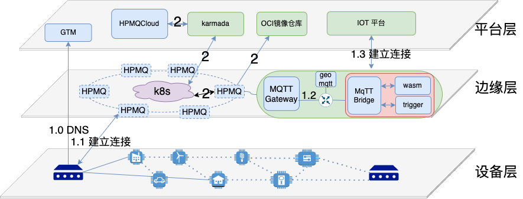

# 简介

HPMQ（Hyperconverged Programmable MQtt）是一款针对物联网特性开发，地理信息分布式，高度可编程的MQTT消息服务器，适用于物联网，车联网等相关领域，它主要有以下几个特性：
* 完全兼容MQTT V3/V5协议
* geo-distributed
* 通过Webassembly技术，可支持多语言开发相关的消息自定义处理
* 支持云原生相关技术，兼容k8s相关协议

# 背景

我们目前正处于万物互联的时代，根据相关机构统计在2022年全球物联网设备首次超过了非物联网设备，而这也带来了数据流向的巨大变化，以往我们海量的数据基本上都产生在数据中心，而物联网时代，海量的数据产生在边缘，我们以之前的数据中心的方式处理中心式海量数据是否还适用于目前海量的边缘数据？如果不满足，那我们是否还有其它的方式来处理？针对这个问题，边缘计算运营而生，HPMQ是针对边缘计算场景而生的下一代MQTT服务器，它承载着我们以下的目的：
* 我们希望它是一个基于地理信息的分布式，可实现用户的设备就近订阅或发布，并兼容标准的MQTT V3/V5协议的MQTT服务器
* 我们希望它支持可编程模式，用户可通过自定义函数的方式处理各类消息，以适应各类场景
* 我们希望它是边缘计算的重要重成部分，传输的连接器，可起到承上启下的作用，一方面把部分算力下沉到边缘层，减少带宽传输，减少数据延迟，另一方面承接底层设备的部分上浮算力，让低层设备也具备云端的灵活性。
* 我们希望它能兼容云原生方案，可通过K8S进行相关的函数及配置的下发，简化函数或配置的分发，简化运维管理

# 场景

## 协议转换

目前的物联网平台可以说是百花齐放，百家争鸣，而每个平台几乎都有自己的一套协议格式，这对低层设备协议格式兼容带来不小的挑战，一般低层设备都注重稳定性，如果在低层设备里做相关的协议兼容，一方面频繁的改动会给硬件设备带来不稳定因素，另一方面也会给固件版本管理带来麻烦。针对这类场景，用户不需要改动它任何的代码，只需要把对接云端的MQTT配置到HPMQ平台上，然后再通过自定义函数的方式就可以自动的对接云端IoT平台的协议格式，并且一旦云端IoT平台的协议格式发生变化，用户也只需要修改自定义函数，不需要做任何的底层固件的更新升级就可以做到协议的兼容。

## 就近接入

HPMQ是基于全球分布式系统，用户可通过DNS就近调度策略实现相关的智能调度，实现设备的就近发布和订阅，比如说智能充电场景，在厦门的用户通过手机扫描下发设备充电指令就可以直接通过厦门HPMQ的节点对接设备，而在北京的用户通过对接的可能就是北京的HPMQ节点。

## 消息去重上报

在某些场景下，可能不需要把重复的数据上报到云端，减少云端的数据量，就可以直接在边缘层做相互的去重处理，在边缘层做去重处理有几点好处：
* 简化设备层逻辑
* 边缘层会存储相关的消息，有利于事后问题的回溯调查

# 相关组件说明
本仓库为HPMQ项目的核心仓库，该仓库可编译成两个可执行文件，分别代表部署在两个不同的部署层次，HPMQ二进制文件主要部署在边缘层，它包括所有的功能，HPMQLite二进制文件主要部署在设备层，它比较轻量，包括部分功能。

* [hpmq-cli](https://github.com/wangjuyunlian/hpmq-cli): 协助开发者进行相关的函数开发的命令行工具的相关代码
* [hpmq-cloud](https://github.com/wangjuyunlian/hpmq-cloud): 云端平台层相关代码

# 核心功能

## geo-distributed mqtt broker 
HPMQ是兼容Mqtt v3/v5协议的全球分布式消息服务器，它是基于边缘计算架构设计的下一代Mqtt服务器。

## Serverless
HPMQ 支持基于边缘函数的方式对消息进行相关的自定义处理。

## 云原生支持
HPMQ 原生支持k8s管理。

